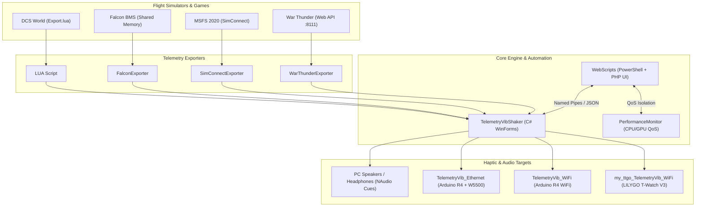

# TelemetryVibShaker & Gaming Performance Suite

## Tech-Flex
- **Win32 Thread & Topology Management:** P/Invoke integration with `GetSystemCpuSetInformation`, `SetThreadSelectedCpuSets`, `SetThreadAffinityMask`, and Windows 11 `EcoQoS` (Power Throttling APIs) for hybrid CPU architectures (Intel Core i7-12700K ➔ i7-14700K).
- **High-Performance UDP Telemetry Pipeline:** Zero-copy binary packet serialization and low-latency UDP socket networking between flight simulators, C# processing engines, and microcontroller hardware.
- **Multi-Simulator Exporter Architecture:** Direct shared memory reading (`FalconBMS`), SimConnect SDK integration (`MSFS 2020`), local Web API JSON scraping (`WarThunder`), and Lua environment hooks (`DCS World`).
- **Low-Latency Audio Processing:** Custom `NAudio` buffer management and zero-alloc `LoopStream` sound playback for dynamic AoA cockpit sound synthesis.
- **Event-Driven IPC & Automation Orchestration:** Atomic `.tmp` ➔ `.json` filesystem rename handoffs, named-pipe server routing (`\.\pipe\`), and multi-host PowerShell process QoS control.
- **Embedded Hardware Firmware:** C++ FreeRTOS task scheduling on ESP32 (`LILYGO T-Watch 2020 V3`) and direct W5500 SPI Ethernet / PWM timer control on Arduino R4.

---

## How This Helps You Be a Better Sim Pilot

As a real F-16 pilot, you know when your angle of attack (AoA) is in the optimal range because your body receives constant physical feedback: G-forces, cockpit buffet sounds, stick pressure, and visual cues. In a flight simulator, those physical sensations are missing. 

I initially built this set of tools to play dynamic audio cues whenever my F-16 was in the optimal AoA bracket—specifically between 11 and 14 degrees for on-speed landing approaches. 

From there, I expanded the system to support other aircraft and critical flight events:
- **F-14 Tomcat Flap Management:** Using the flap trick during dogfights is deadly effective, but exceeding 220 knots with flaps deployed risks ripping them off. TelemetryVibShaker drives a small cellphone vibration motor mounted directly on my throttle/joystick. The physical vibration immediately reminds me to retract flaps before overspeeding.
- **Speed Brake Cues:** Tactile vibration feedback whenever speed brakes are extended keeps me aware of airframe drag without taking my eyes off the bandit.
- **VR Blindfold Comfort:** Flying in VR means you are blind to the real world. Light web control panels and phone-based triggers allow managing windows, power plans, and mission setups without ever taking off the headset.

*Hardware Evolution Note:* This project was originally designed and tuned on an **Intel Core i7-12700K** (8 Performance + 4 Efficiency cores) and has since been upgraded to an **Intel Core i7-14700K** (8 Performance + 12 Efficiency cores). The underlying CPU QoS and thread assignment engines reflect this hybrid architecture evolution.

---

## System Architecture

---

## Component Map & Directory Layout

### Core Engine
- **[TelemetryVibShaker](file:///c:/Users/ralch/source/repos/rolex20/TelemetryVibShaker/TelemetryVibShaker/README.md):** Main Windows C# application. Synthesizes AoA sound effects, manages haptic motor curves, processes incoming UDP telemetry, and hosts named-pipe remote control listeners.

### Telemetry Exporters
- **[LUA Script](file:///c:/Users/ralch/source/repos/rolex20/TelemetryVibShaker/LUA%20Script/README.md):** DCS World `Export.lua` script for streaming AoA, gear, flap, and speed brake telemetry over UDP.
- **[FalconExporter](file:///c:/Users/ralch/source/repos/rolex20/TelemetryVibShaker/FalconExporter/README.md):** Reads Falcon BMS shared memory structures and broadcasts telemetry via UDP.
- **[SimConnectExporter](file:///c:/Users/ralch/source/repos/rolex20/TelemetryVibShaker/SimConnectExporter/README.md):** Interfaces with MSFS 2020 via native SimConnect SDK to output flight metrics over UDP.
- **[WarThunderExporter](file:///c:/Users/ralch/source/repos/rolex20/TelemetryVibShaker/WarThunderExporter/README.md):** Polls War Thunder's internal web API (`http://localhost:8111`) and translates flight parameters into telemetry packets.

### Microcontroller Firmware & Haptic Hardware
- **[TelemetryVib_Ethernet](file:///c:/Users/ralch/source/repos/rolex20/TelemetryVibShaker/TelemetryVib_Ethernet/Readme.md):** Arduino R4 Ethernet firmware (W5500 shield). Zero-delay wired haptic driver for throttle/joystick vibration motors.
- **[TelemetryVib_WiFi](file:///c:/Users/ralch/source/repos/rolex20/TelemetryVibShaker/TelemetryVib_WiFi/README.md):** Arduino R4 WiFi firmware for wireless vibration motor control.
- **[my_ttgo_TelemetryVib_WiFi](file:///c:/Users/ralch/source/repos/rolex20/TelemetryVibShaker/my_ttgo_TelemetryVib_WiFi/README.md):** LILYGO T-Watch 2020 V3 wearable firmware (ESP32). Provides wrist haptics and visual AoA indexer display (Yellow/Green/Red).

### System Performance & Automation
- **[PerformanceMonitor](file:///c:/Users/ralch/source/repos/rolex20/TelemetryVibShaker/PerformanceMonitor/Readme.md):** Real-time hybrid CPU utilization graph (P-Cores vs E-Cores vs HT) and NVIDIA GPU monitor.
- **[WebScripts](file:///c:/Users/ralch/source/repos/rolex20/TelemetryVibShaker/WebScripts/README.md):** Suite containing PowerShell IPC watchers (`ps_scripts`), VR phone remote control panel (`remote_control`), and War Thunder dogfight mission builder (`warthunder`).
- **[MicroTaskScheduler](file:///c:/Users/ralch/source/repos/rolex20/TelemetryVibShaker/MicroTaskScheduler/README.md):** Background Windows Service for pinning auxiliary tasks to E-Cores.

### Diagnostics & Utilities
- **[LocalNetworkDelay](file:///c:/Users/ralch/source/repos/rolex20/TelemetryVibShaker/LocalNetworkDelay/README.md):** High-precision UDP latency bench tool used to discover the 20ms internal WiFi delay on Arduino R4.
- **[NvidiaLightPerfCounters](file:///c:/Users/ralch/source/repos/rolex20/TelemetryVibShaker/NvidiaLightPerfCounters/README.md):** Lightweight NVAPI performance counter monitoring service.
- **[RemoteWindowControl](file:///c:/Users/ralch/source/repos/rolex20/TelemetryVibShaker/RemoteWindowControl/README.md):** Standalone WinForms utility for moving/minimizing windows over IPC.
- **[TelemetryGenerator](file:///c:/Users/ralch/source/repos/rolex20/TelemetryVibShaker/TelemetryGenerator/README.md):** Synthetic telemetry packet generator for hardware and audio testing.
- **[UDP_Echo_Server](file:///c:/Users/ralch/source/repos/rolex20/TelemetryVibShaker/UDP_Echo_Server/README.md):** Low-overhead UDP echo test server.
- **[WAV Test Player](file:///c:/Users/ralch/source/repos/rolex20/TelemetryVibShaker/WAV%20Test%20Player/README.md):** Audio test bed for NAudio loop stream tuning.
- **[FloatingPointPerformance](file:///c:/Users/ralch/source/repos/rolex20/TelemetryVibShaker/FloatingPointPerformance/README.md):** Multi-threaded FPU benchmark tool.

---

## CPU QoS Implementation Status & Project Roadmap

### CPU QoS Migration Status
- **Current Baseline (`CPU_QoS_Desktop.cs`):** The desktop-optimized CPU Quality of Service engine is fully implemented in `CPU_QoS_Desktop.cs` (and active in `PerformanceMonitor`). It targets single-processor group architectures (≤ 64 logical cores), dynamically discovers E-Core vs P-Core efficiency classes via `SYSTEM_CPU_SET_INFORMATION`, and supports Windows 11 EcoQoS, CPU Sets, and hard affinity masks.
- **Exporters & Utilities:** Projects like `TelemetryVibShaker`, `FalconExporter`, `SimConnectExporter`, and `WarThunderExporter` currently utilize an older heuristic in `ProcessorAssigner.cs`.

### ToDo & Roadmap
- [ ] **Migrate All C# Projects to `CPU_QoS_Desktop.cs`:** Standardize `TelemetryVibShaker`, `FalconExporter`, `SimConnectExporter`, and `WarThunderExporter` onto the desktop `CPU_QoS` engine for unified P/E-core handling on Intel 12700K / 14700K processors.
- [ ] **Unified Firmware Build:** Combine `TelemetryVib_Ethernet` and `TelemetryVib_WiFi` into a single smart Arduino R4 firmware that defaults to Ethernet when plugged in, falling back to WiFi otherwise.
- [ ] **Complete Hardware Wiring Diagrams:** Add clear pinout schematics for vibration motors and transistor drivers across Arduino and T-Watch projects.
- [ ] **Expand Remote Control Presets:** Add one-tap flight profiles (power plan + boost level + window layout) to the `remote_control` web UI.
