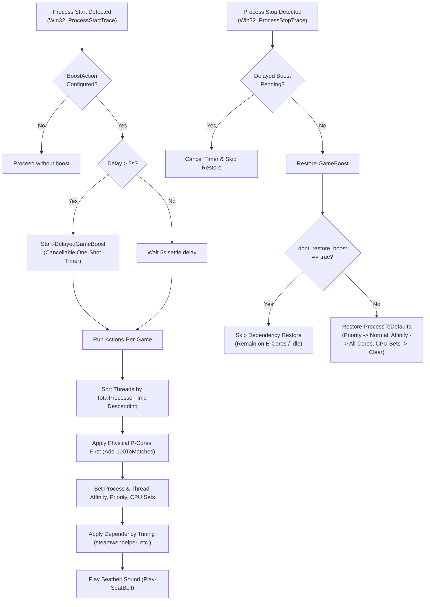

# WebScripts/ps_scripts — Performance-first Windows watcher toolkit (PowerShell 5.1)

This folder contains the PowerShell side of my “hands-off” gaming/VR rig automation: lightweight watchers that react to **file events**, **process start/stop events**, and **IPC commands** to help me find stutters, diagnose scheduling drift, and apply repeatable tuning without touching the desktop mid-session.

**Tech flex:** deep **Windows scheduling control via PowerShell + C# Win32 interop**—CPU Sets topology discovery and per-process/per-thread CPU-set steering (`GetSystemCpuSetInformation`, `SetProcessDefaultCpuSets`, `SetThreadSelectedCpuSets`) combined with **thread-level EcoQoS / Efficiency Mode** via `SetThreadInformation` (Win11 class 3 → Win10 class 1 fallback) so background/support threads stay “cheap” on hybrid Alder/Raptor Lake rigs; **real-time process lifecycle automation** using `Register-CimIndicationEvent` on `Win32_ProcessStartTrace/StopTrace` with instant process termination (`ImmediateKill`) for unwanted background hogs before any side effects fire; an **asynchronous Named Pipe IPC layer** (`NamedPipeServerStream`) with explicit **PipeSecurity/ACL**, command parsing, and CPU-time delta introspection for stutter hunting (`Stutter-Hunter-IPC.ps1`); **kernel32 priority + background I/O tuning** (`SetPriorityClass(PROCESS_MODE_BACKGROUND_BEGIN)` and idle priority) to keep the watcher from stealing performance; **PID-based gameplay runtime telemetry** with persistent disk snapshots (`Cpu-Snapshots.ps1`) to reliably capture CPU/wall-clock usage across process handle exits; and a PS 5.1-friendly **precompiled + disk-cached C# pipeline** (`Import-OptimizedCSharp.ps1`) that builds an optimized (`/optimize+`) DLL once, reuses it when valid, and loads from a byte array to avoid file locking—so even older laptops don’t pay the “recompile every run” tax. Rounding it out: **event-driven filesystem orchestration** with `FileSystemWatcher` + atomic rename handoffs (PHP/WAMP drops `.tmp` → `.json`), **multi-machine host configuration layering** with dynamic hot-reloading (`config/hosts.config.json` + `Get-HostConfig.ps1`), **multithreaded background execution** with `Start-ThreadJob`, and **TTS feedback** (System.Speech) so state changes are audible when you’re busy / in VR with the headset strapped to your face.

---

## Why this exists (hybrid-core reality & multi-machine automation)

This setup is optimized for my Alder/Raptor Lake hybrid gaming CPU as well as my fleet of gaming and utility machines. Early on, VR sims + Windows background activity could end up on the wrong cores at the wrong time. Furthermore, legacy/older laptops (such as test machines with thermal paste issues) needed aggressive background process killing to avoid BSODs and CPU hangs. I wanted flexibility beyond generic tooling: per-process policies, immediate process termination on launch, per-thread steering, auxiliary tool lifecycle management, and quick visibility into CPU time while a sim is running.

Everything here is modular and host-aware. You can enable/disable watchers per-machine and customize game profiles via `config/hosts.config.json` without modifying script code.

---

## Quick start (PowerShell 5.1)

1. Edit host config: `ps_scripts/config/hosts.config.json`
   - Configure global `defaults` or add a host-specific block under `machines.<HOSTNAME>`.
   - Enable only the feature flags (`processWatcher`, `ipcServer`, `remoteCommandsWatcher`, etc.) you want for your machine.
   - Define game profiles, TTS options, auxiliary programs, or `ImmediateKill` targets.
2. Run: `Start-CommandWatchers.ps1`

> **Note on configuration**: `Gaming-Programs.ps1` automatically consumes `config/hosts.config.json` via `Bootstrap-Config` / `Get-WebScriptsConfig`. You do **not** edit `Gaming-Programs.ps1` to configure games—all profiles, power plans, TTS messages, and auxiliary applications are declared in `config/hosts.config.json`.

---

## Architecture and file map

### Entry point / orchestrator
**`Start-CommandWatchers.ps1` wires everything together:**
- Enforces single instance (named mutex protection with explicit owner checks)
- Tunes itself to stay out of the way (efficiency-core affinity + idle/background priority via kernel32 interop)
- Bootstraps host configuration via `Get-HostConfig.ps1` / `Bootstrap-Config`
- Loads shared helpers via deterministic `$PSScriptRoot` dot-sourcing
- Conditionally spins up watchers based on `config/hosts.config.json` feature flags
- Initializes auxiliary program lifecycle state tracking (`New-AuxProgramLifecycleState`)
- Maintains a watchdog loop (`Watchdog-Operations.ps1`) and self-restarts cleanly if eventing gets stuck or critical config sections change

### Multi-Machine Host Configuration (`config/hosts.config.json` & `Get-HostConfig.ps1`)
Configuration is centralized in `config/hosts.config.json` and parsed by `Get-HostConfig.ps1`:
- **Defaults vs Host Overrides**: Base settings land under `defaults`, while host-specific overrides live under `machines.<HOSTNAME>` (e.g. `GALVATRON`, `ALIENWARE-V2`, `HP-PAV-BLACK`).
- **Feature Flags**: Toggles per-machine functionality (`processWatcher`, `ipcServer`, `remoteCommandsWatcher`, `warThunderMissionWatcher`, `warThunderDistanceMonitor`, `watchdog`).
- **Dynamic Hot-Reloading (`Refresh-WebScriptsConfigIfChanged`)**: On every watchdog interval, the watcher checks file timestamps.
  - **Live Updates**: Value-only edits (e.g. TTS speak text, nicknames, boost actions) are applied live without interrupting watchers.
  - **Auto-Restart**: Structural edits (changing feature flags, adding/removing game profiles, modifying paths) automatically trigger a clean orchestrator restart when `restart_on_config_change: true`.

### Event sources (inputs)
There are three main “inputs” that drive actions:

1) **Process start/stop watcher (game lifecycle & immediate kill)**
- Implemented via CIM indication events on `Win32_ProcessStartTrace` and `Win32_ProcessStopTrace` (`Get-ProcessWatcher.ps1`).
- Passes process events to `Set-GamePowerScheme.ps1`.
- **Immediate Kill**: Evaluates `"ImmediateKill": true` on start trace *before* any power scheme, aux launch, boost, or telemetry side-effects occur.
- On standard start/stop events, it handles power scheme switching, stutter hunter enrollment, auxiliary tool launching, boost action execution, and gameplay runtime tracking.

2) **Remote JSON command pipeline (file rename handoff)**
- A `FileSystemWatcher` wrapped by `Get-RenamesWatcher.ps1` listens for **rename** events (atomic handoff).
- Typical flow: a PHP page or TelemetryVibShaker app writes `command.tmp` then renames to `command.json`.
- On rename, `Process-CommandFromJson.ps1` parses the JSON payload and dispatches actions.

3) **IPC (named pipe commands)**
- `Declare-IPC-Server-Action.ps1` runs an asynchronous NamedPipe server in a thread job (`Start-ThreadJob`).
- Accepts simple commands (speak, window positioning, foregrounding, show-process CPU deltas, exit commands).
- Serves as a fast side-channel for real-time control without disk I/O overhead.

---

### File Index & Module Breakdown

| Script / File | Category | Description |
| :--- | :--- | :--- |
| **`Start-CommandWatchers.ps1`** | Orchestrator | Main entry point; handles mutex lock, self-tuning, watcher setup, watchdog loop, and cleanup. |
| **`config/hosts.config.json`** | Configuration | Central multi-machine configuration file for defaults, machine overrides, feature flags, and game profiles. |
| **`Get-HostConfig.ps1`** | Config Engine | JSON parser, hashtable recursive converter, host override merger, and hot-reload diff detector. |
| **`Gaming-Programs.ps1`** | Profile Helper | Exposes profile lookup functions (`Get-StartPowerSchemes`, `Get-GameAuxPrograms`, `Get-ImmediateKill`, etc.) backed by `hosts.config.json`. |
| **`Aux-Programs.ps1`** | Aux Lifecycle | Auxiliary program parser, process/ps1 matcher, PID ownership discovery (`OwnedOnly`), and cleanup controller. |
| **`Set-GamePowerScheme.ps1`** | Lifecycle Handler | Core event handler for process start/stop events; coordinates ImmediateKill, power plans, AuxPrograms, Stutter Hunter, runtime tracking, and two-phase boost actions. |
| **`Cpu-Snapshots.ps1`** | Telemetry | Persistent disk snapshot helper (`Save-GameRuntimeCpuSnapshot`, `Read-GameRuntimeCpuSnapshot`) for tracking process CPU time across exits. |
| **`Stutter-Hunter-IPC.ps1`** | Telemetry / IPC | Centralized IPC coordinator and client script for monitoring CPU time deltas and identifying micro-stutters. |
| **`Stutter-Hunter.ps1`** | Telemetry | Legacy standalone process stutter tracking script. |
| **`Show-CPU-Time-PerProcess.ps1`** | Introspection | Formats and outputs process CPU time deltas over configurable sampling windows. |
| **`Set-PowerScheme.ps1`** | Power Control | Switches Windows power plans (High Performance, Balanced, Power Saver, custom GUIDs). |
| **`Set-IdealProcessor.ps1`** | Scheduling | Configures CPU affinity, thread ideal processors, and process priority. |
| **`SetGet-DefaultCpuSets.ps1`** | Scheduling | Query and set system/process default CPU Sets via Win32 API. |
| **`SetAffinityAndPriority.ps1`** | Scheduling | Self-tuning script to move the watcher onto Efficiency Cores and background priority. |
| **`Import-OptimizedCSharp.ps1`** | Interop Engine | Compiles `/optimize+` C# Win32 interop DLLs on demand with disk caching and byte-array loading to avoid file locking. |
| **`Process-CommandFromJson.ps1`** | Dispatcher | Parses remote control JSON commands (window style, focus, power, boost) and invokes target functions. |
| **`Declare-IPC-Server-Action.ps1`** | IPC Server | Named Pipe server implementation running in a dedicated thread job for async IPC command processing. |
| **`Send-MessageViaPipe.ps1`** | IPC Client | Client script for sending commands to the Named Pipe IPC server. |
| **`Send-IPC-ExitCommand.ps1`** | IPC Client | Client helper to signal the IPC pipe server to terminate gracefully. |
| **`Get-ProcessWatcher.ps1`** | Event Source | Registers CIM indication events on `Win32_ProcessStartTrace` and `Win32_ProcessStopTrace`. |
| **`Get-RenamesWatcher.ps1`** | Event Source | Wraps `FileSystemWatcher` to listen specifically for atomic rename events (`.tmp` → `.json`). |
| **`Watchdog-Operations.ps1`** | Monitoring | Health monitor loop that checks event subscription integrity and signals orchestrator restarts if stuck. |
| **`Check-Admin-Privileges.ps1`** | Utility | Verifies elevation and warns if running without administrative rights required for scheduling/power tweaks. |
| **`Write-VerboseDebug.ps1`** | Utility | Centralized logging helper with timestamp formatting, color coding, and TTS speech integration (`System.Speech`). |
| **`Set-ForegroundProcess.ps1`** | Window Control | Brings target window to foreground via Win32 `SetForegroundWindow` interop. |
| **`Set-Minimize.ps1`** | Window Control | Minimizes target process windows. |
| **`Set-Maximize.ps1`** | Window Control | Maximizes target process windows. |
| **`Set-WindowsPosition.ps1`** | Window Control | Sets exact window position and dimensions via `MoveWindow`. |
| **`Get-WindowLocation.ps1`** | Window Control | Queries exact rectangle coordinates of process windows. |
| **`IP_Tracker_Agent.ps1`** | Network Agent | Tracks external IP changes and records network status. |
| **`Monitor-War-Thunder-Distance-Multiplier.ps1`** | Sim Helper | Watches War Thunder configuration files and restores custom distance multipliers if rewritten by the game. |
| **`WT_MissionType1.ps1`** | Sim Helper | Generates custom War Thunder mission configurations from JSON templates. |

---

## Game profiles and customization (`config/hosts.config.json`)

To add or modify games, edit `config/hosts.config.json` under your machine's entry in `machines.<HOSTNAME>.gameProfiles` (or under `defaults.gameProfiles`).

### Profile Schema Example

```json
"DCS.exe": {
  "NickName": "DCS World",
  "Speak": "Starting Digital Combat Simulator",
  "Start": "High Performance",
  "Stop": "Balanced",
  "ImmediateKill": false,
  "Stutter": true,
  "BoostAction": "action-per-process-boost1.json",
  "BoostActionDelaySeconds": 5,
  "AuxProgramsDelaySeconds": 5,
  "WindowStyle": "Minimized",
  "AuxPrograms": [
    "[FanatecMonitor.exe]C:\\Users\\ralch\\Desktop\\C-Fanatec Monitor.lnk",
    {
      "Id": "MyPowerShellHelper",
      "Path": "C:\\Users\\ralch\\Desktop\\My Helper.lnk",
      "MatchType": "PowerShellScript",
      "ScriptPath": "C:\\MyPrograms\\Helpers\\MyHelper.ps1",
      "LaunchMode": "IfNotRunning",
      "StopMode": "OwnedOnly",
      "StartupTimeoutSeconds": 10
    }
  ]
}
```

### Formal Profile Field Reference

| Profile Field | Data Type | Default Value | Allowed Options / Values | Description & Functionality |
| :--- | :--- | :--- | :--- | :--- |
| **`NickName`** | String | Process Name | Any string | Human-readable / TTS-friendly display name (used in session notifications, log titles, and exit summaries). |
| **`Speak`** | String | `null` | Any text string | Custom text-to-speech phrase spoken by `System.Speech` when the process starts or exits. If omitted, default TTS is generated from `NickName`. |
| **`Start`** | String | `null` | Power scheme name (e.g. `"High Performance"`, `"Balanced"`, or GUID) | Windows power plan applied when the monitored game process starts. |
| **`Stop`** | String | `null` | Power scheme name (e.g. `"Balanced"`, `"Power Saver"`, or GUID) | Windows power plan applied when the monitored game process exits. |
| **`ImmediateKill`** | Boolean | `false` | `true`, `false` | When `true`, forcibly terminates (`Stop-Process -Force`) the process immediately upon detection *before* any power schemes, aux programs, boost actions, TTS, or runtime trackers execute. Designed for blocking background hogs (`TiWorker.exe`, `CompatTelRunner.exe`) on legacy machines. |
| **`Stutter`** | Boolean | `false` | `true`, `false` | When `true`, registers the process with `Stutter-Hunter-IPC.ps1` for real-time stutter tracking and CPU time delta introspection. |
| **`BoostAction`** | String | `null` | Path to JSON file (e.g. `"action-per-process-boost1.json"`) | Relative JSON policy path containing process priority, CPU affinity masks, CPU Sets, or thread EcoQoS settings. |
| **`BoostActionDelaySeconds`** | Integer | `5` | Non-negative integer (`>= 0`) | Delay in seconds after game launch before `BoostAction` is applied. Delays above the legacy 5-second settle time are scheduled with a one-shot timer and canceled if the original game PID exits before the boost is due, so long delays do not block process watcher callbacks. |
| **`AuxProgramsDelaySeconds`** | Integer | `5` | Non-negative integer (`>= 0`) | Delay in seconds after game launch before auxiliary programs are started. Allows anchoring aux program launches relative to game startup. |
| **`WindowStyle`** | String | `"Minimized"` | `"Normal"`, `"Hidden"`, `"Minimized"`, `"Maximized"` | Window state passed to `Start-Process -WindowStyle` when launching auxiliary program shortcuts or executables. |
| **`AuxPrograms`** | Array | `[]` | Array of Strings or JSON objects | List of auxiliary tools, shortcuts, or scripts to launch and optionally track alongside the game process lifecycle. |


## Process Launch Command-Line Logging
Command-line logging can be enabled independently for any monitored process by adding the following field to its "gameProfiles" entry in "config/hosts.config.json":

```json
"CommandLine": true
```

Example:
```json
"forza_steamworks_release_final.exe": {
  "NickName": "Forza",
  "Start": "Balanced",
  "Stop": "Balanced",
  "CommandLine": true
}
```

When the process starts, "Start-CommandWatchers.ps1" attempts to retrieve the full launch command line from "Win32_Process.CommandLine", including the executable path and any command-line arguments. The process parent name and PID are also included in the start-event diagnostic output.

Example output:
```
PROCESS: Win32_ProcessStartTrace - forza_steamworks_release_final.exe [12345] - PARENT: steam [6789] - CMD: "C:\Program Files (x86)\Steam\steamapps\common\Forza Motorsport\forza_steamworks_release_final.exe" <arguments>
```

Command-line capture is disabled by default to avoid unnecessary CIM queries and log noise. The lookup is best-effort, so very short-lived processes may exit before the command line can be retrieved.

«Backward compatibility: "Start-CommandWatchers.ps1" also recognizes the legacy misspelled key "ComandLine", but new configuration should always use "CommandLine".»


## Auxiliary program lifecycle formats (`Aux-Programs.ps1`)

The `AuxPrograms` array accepts **four distinct formats** that can be **freely mixed in the same array**. Each entry is evaluated independently, so you can combine legacy paths, shorthand strings, and structured objects in any order within the same game profile.

> **Tip**: All shorthand string entries start with `[` and all structured entries are JSON objects `{}`. Anything else is treated as a legacy path string.

---

### 1. Legacy Path String

```json
"AuxPrograms": [
  "C:\\Users\\ralch\\Desktop\\Disable-Antivirus.ps1.lnk"
]
```

**Behavior**: Launches the path every time the game starts, unconditionally. Does not check for existing instances, does not track PID ownership, and **never terminates** the program when the game exits.

- `LaunchMode = Always`
- `StopMode = Never`

---

### 2. Executable Shorthand

General syntax: `"[<prefix>ExeName.exe]C:\path\to\launch.lnk"`

The prefix controls the launch and stop behavior. All prefixes are **case-insensitive**.

#### Complete Prefix Reference

| Prefix | Example | LaunchMode | StopMode | Description |
| :--- | :--- | :--- | :--- | :--- |
| *(none)* | `[Proc.exe]Path` | `IfNotRunning` | `Never` | Skip launch if already running. Never stops the process on game exit. |
| `kill:` | `[kill:Proc.exe]Path` | `KillExistingAndLaunch` | `OwnedOnly` | Kill pre-existing instances before launch. Track and stop the newly spawned instance on game exit. |
| `killall:` | `[killall:Proc.exe]Path` | `KillExistingAndLaunch` | `ForceAll` | Kill pre-existing instances before launch. Unconditionally kill **all** matching instances on game exit. |
| `kill-all:` | `[kill-all:Proc.exe]Path` | `KillExistingAndLaunch` | `ForceAll` | Alias for `killall:`. Identical behavior. |
| `forceall:` | `[forceall:Proc.exe]Path` | `KillExistingAndLaunch` | `ForceAll` | Alias for `killall:`. Identical behavior. |

```json
"AuxPrograms": [
  "[FanatecMonitor.exe]C:\\Users\\ralch\\Desktop\\C-Fanatec Monitor.lnk",
  "[kill:FanatecMonitor.exe]C:\\Users\\ralch\\Desktop\\C-Fanatec Monitor.lnk",
  "[killall:FanatecMonitor.exe]C:\\Users\\ralch\\Desktop\\C-Fanatec Monitor.lnk"
]
```

> **Note**: The `.exe` extension is optional in the matcher. `[FanatecMonitor]` and `[FanatecMonitor.exe]` both match the same process.

---

### 3. PowerShell Script Shorthand

Used when the auxiliary tool is a `powershell.exe` process running a specific `.ps1` script. The watcher detects it by inspecting the command lines of running `powershell.exe` processes via `Win32_Process` CIM queries rather than just the process name.

General syntax: `"[<prefix>ps1:<scriptMatcher>]C:\path\to\launch.lnk"`

The `ps1:` token always follows any kill prefix. The `<scriptMatcher>` can be either:
- **A filename only** (e.g. `MyHelper.ps1`) — matches any running `powershell.exe` whose command line contains that filename at a word/path boundary.
- **An absolute path** (e.g. `C:\Scripts\MyHelper.ps1`) — matches only the exact absolute path. Forward slashes are also accepted.

#### Complete Prefix Reference

| Prefix | Example | LaunchMode | StopMode | Description |
| :--- | :--- | :--- | :--- | :--- |
| *(none)* | `[ps1:Script.ps1]Path` | `IfNotRunning` | `Never` | Skip launch if script is already running. Never stops it on game exit. |
| *(none, full path)* | `[ps1:C:\dir\Script.ps1]Path` | `IfNotRunning` | `Never` | Same as above using absolute path matching. |
| `kill:` | `[kill:ps1:Script.ps1]Path` | `KillExistingAndLaunch` | `OwnedOnly` | Kill pre-existing script instances before launch. Track and stop the newly spawned instance on game exit. |
| `kill:` | `[kill:ps1:C:\dir\Script.ps1]Path` | `KillExistingAndLaunch` | `OwnedOnly` | Same with absolute path matching. |
| `killall:` | `[killall:ps1:Script.ps1]Path` | `KillExistingAndLaunch` | `ForceAll` | Kill pre-existing instances before launch. Unconditionally kill **all** matching `powershell.exe` running this script on game exit. |
| `killall:` | `[killall:ps1:C:\dir\Script.ps1]Path` | `KillExistingAndLaunch` | `ForceAll` | Same with absolute path matching. |
| `kill-all:` | `[kill-all:ps1:Script.ps1]Path` | `KillExistingAndLaunch` | `ForceAll` | Alias for `killall:`. |
| `forceall:` | `[forceall:ps1:Script.ps1]Path` | `KillExistingAndLaunch` | `ForceAll` | Alias for `killall:`. |

```json
"AuxPrograms": [
  "[ps1:MyHelper.ps1]C:\\Users\\ralch\\Desktop\\My Helper.lnk",
  "[ps1:C:\\MyPrograms\\Helpers\\MyHelper.ps1]C:\\Users\\ralch\\Desktop\\My Helper.lnk",
  "[kill:ps1:MyHelper.ps1]C:\\Users\\ralch\\Desktop\\My Helper.lnk",
  "[killall:ps1:C:\\MyPrograms\\Helpers\\MyHelper.ps1]C:\\Users\\ralch\\Desktop\\My Helper.lnk"
]
```

> **Note**: Relative paths (e.g. `[ps1:subdir\Script.ps1]`) are **not supported** and will be rejected with a warning. Use a filename only or a full absolute path.

---

### 4. Structured Definition (Full Lifecycle & Ownership Control)

Structured JSON objects provide the most precise control over every aspect of the auxiliary lifecycle. Any field that the shorthand formats set implicitly can be configured explicitly here, and additional fields like `Id`, `PowerShellHostProcessName`, and `StartupTimeoutSeconds` are only available in this format.

```json
"AuxPrograms": [
  {
    "Id": "FanatecMonitor",
    "Path": "C:\\Users\\ralch\\Desktop\\C-Fanatec Monitor.lnk",
    "MatchType": "ProcessName",
    "ProcessName": "FanatecMonitor.exe",
    "LaunchMode": "KillExistingAndLaunch",
    "StopMode": "ForceAll",
    "StartupTimeoutSeconds": 10
  }
]
```

#### Formal Field Reference for Structured AuxPrograms Definitions

| Field | Data Type | Default | Required? | Allowed Values | Description |
| :--- | :--- | :--- | :--- | :--- | :--- |
| **`Id`** | String | Derived from matcher | Optional (Recommended) | Any case-insensitive string (e.g. `"FanatecMonitor"`) | Uniquely identifies a logical shared auxiliary tool. When multiple running games share the same `Id`, the watcher registers them as joint consumers. The auxiliary process remains running until the **final** consumer game exits. |
| **`Path`** | String | *None* | **Required** | Absolute file path, executable, or `.lnk` shortcut | The target shortcut or binary path passed to `Start-Process` when launching the auxiliary program. Backslashes must be doubled (`\\\\`) in JSON. |
| **`MatchType`** | String | *None* | **Required** | `"ProcessName"`, `"PowerShellScript"` | Defines how the watcher identifies running instances via `Win32_Process`:<br>• `"ProcessName"`: Matches by process image name (e.g. `FanatecMonitor.exe`).<br>• `"PowerShellScript"`: Matches `powershell.exe` processes by inspecting their command lines for the configured script. |
| **`ProcessName`** | String | `null` | Required if `MatchType = "ProcessName"` | Executable name with or without `.exe` (e.g. `"FanatecMonitor.exe"`) | The process image name to match. `.exe` suffix is normalized automatically. |
| **`ScriptPath`** | String | `null` | Optional (`MatchType = "PowerShellScript"`) | Absolute `.ps1` path (e.g. `"C:\\Helpers\\Script.ps1"`) | Matches `powershell.exe` processes whose command lines reference this exact absolute path. Forward slashes are accepted. Takes precedence over `ScriptName` when both are provided. |
| **`ScriptName`** | String | `null` | Optional (`MatchType = "PowerShellScript"`) | Script filename ending in `.ps1`, no path separators (e.g. `"Script.ps1"`) | Matches `powershell.exe` processes whose command lines contain this filename at a word/path boundary. `Script.ps1` will **not** match `NotScript.ps1`. |
| **`PowerShellHostProcessName`** | String | `"powershell.exe"` | Optional | Executable leaf name (e.g. `"powershell.exe"`, `"pwsh.exe"`) | The host process image name to inspect. Defaults to Windows PowerShell 5.1. Change to `"pwsh.exe"` for PowerShell 7+. |
| **`LaunchMode`** | String | `"Always"` | Optional | `"Always"`, `"IfNotRunning"`, `"KillExistingAndLaunch"` | Controls when `Start-Process` fires on game start:<br>• **`"Always"`**: Launches unconditionally every time, regardless of existing instances.<br>• **`"IfNotRunning"`**: Skips launch if a matching process already exists.<br>• **`"KillExistingAndLaunch"`** (aliases: `"KillExisting"`, `"KillExistingBeforeLaunch"`): Forcibly terminates all pre-existing matching processes, then launches a fresh copy. |
| **`StopMode`** | String | `"Never"` | Optional | `"Never"`, `"OwnedOnly"`, `"ForceAll"` | Controls cleanup when the monitored game exits:<br>• **`"Never"`**: The auxiliary process is left running indefinitely.<br>• **`"OwnedOnly"`**: Stops only the specific PID(s) this watcher launched and claimed for this game session. Pre-existing processes are never touched.<br>• **`"ForceAll"`** (aliases: `"KillAll"`, `"AllMatching"`): Unconditionally kills every matching process on game exit, regardless of ownership or creation time. |
| **`StartupTimeoutSeconds`** | Integer | `10` | Optional | Non-negative integer (`>= 0`) | How long (in seconds) the watcher polls `Win32_Process` after launch to discover and claim the new PID(s). Only meaningful when `StopMode = "OwnedOnly"`. |

#### Detailed Mechanics

1. **Before-and-After PID Discovery (`OwnedOnly`)**:
   Because `.lnk` shortcuts and indirect launchers don't return a final PID from `Start-Process`, `OwnedOnly` uses bounded polling:
   - **Before Launch**: Snapshots all existing PIDs matching `MatchType`.
   - **Launch**: Calls `Start-Process`.
   - **After Launch**: Polls `Win32_Process` for up to `StartupTimeoutSeconds` until the set of PIDs is stable for 500ms.
   - **Claiming**: Records only newly appeared PIDs whose `CreationDate` is at or after the launch timestamp. Pre-existing PIDs are never claimed.

2. **Unconditional Exit Cleanup (`ForceAll`)**:
   No PID tracking is needed at launch time. On game exit the watcher simply queries `Win32_Process` for all currently matching processes and force-kills each one.

3. **Shared Consumers across Games**:
   - Game A starts → auxiliary `"FanatecMonitor"` (PID 1234) is launched and claimed.
   - Game B starts → the auxiliary is already running, so launch is skipped. Game B is registered as a second consumer.
   - Game A exits → one consumer remains (Game B). PID 1234 is **retained**.
   - Game B exits → zero consumers remain. Cleanup runs.

4. **Watcher Restart Safety**:
   Ownership records live in memory only. If the watcher restarts, surviving auxiliary processes are treated as pre-existing and will not be terminated by `OwnedOnly` on future exits. `ForceAll` is immune to this because it does not rely on ownership records.

---

## Gameplay Telemetry & CPU Runtime Tracking (`Cpu-Snapshots.ps1`)

The toolkit provides "hands-off" session tracking without polling overhead:

1. **PID-Keyed Tracking**: Monitored games spawn a runtime tracking timer (`Start-GameRuntimeTracker`). Tracking is keyed by PID (not process name) so multiple concurrent instances do not collide.
2. **Persistent Disk Snapshots (`Cpu-Snapshots.ps1`)**:
   - Every 30 minutes (and on startup), CPU time is sampled and persisted to disk via `Save-GameRuntimeCpuSnapshot`.
   - **Zombie Handle Protection**: When a process exits, OS process handle stats can occasionally report 0 seconds or fail to refresh. The stop handler (`Stop-GameRuntimeTracker`) cross-checks live data against disk snapshots to guarantee accurate total CPU time reporting.
3. **Audio Feedback**:
   - Speaks hourly milestones during long gaming sessions (*"DCS World - 2 hours"*).
   - Speaks total gameplay duration on exit (*"War Thunder stopped, 1 hour 15 minutes total"*).

---

## Boost profiles and process tuning (`action-per-process-boost*.json`)

Boost profiles define fine-grained hardware scheduling, processor affinity masks, Windows CPU Sets, ideal processor distribution, and thread priorities for games and their background dependencies. They are implemented in [`Set-IdealProcessor.ps1`](Set-IdealProcessor.ps1) and orchestrated by [`Set-GamePowerScheme.ps1`](Set-GamePowerScheme.ps1) on game start and stop events.

Boost actions can be associated with any game profile in `config/hosts.config.json` via the `"BoostAction"` (JSON file path) and `"BoostActionDelaySeconds"` (settle delay) properties, or triggered dynamically via remote JSON / IPC commands (`"GAME_BOOST"` in [`Process-CommandFromJson.ps1`](Process-CommandFromJson.ps1)).

---

### Boost Profile JSON Schema & Field Reference

Each boost JSON file contains an array of process boost definition objects.

```json
[
  {
    "comment": "Optional descriptive note",
    "process_name": "TargetProcessName",
    "parameters": {
      "process_affinity": "DoNotChange",
      "process_priority": "AboveNormal",
      "thread_ideal_processor": "P-Cores",
      "thread_priority": "AboveNormal",
      "thread_cpu_sets": "DoNotChange",
      "process_change_cpu_sets": true,
      "override_higher_priority": false,
      "max_threads_to_change": 5,
      "dependencies": [
        {
          "process_name": "steamwebhelper",
          "dont_restore_boost": true,
          "process_affinity": "E-Cores",
          "process_priority": "Idle",
          "thread_ideal_processor": "E-Cores",
          "thread_priority": "Idle",
          "thread_cpu_sets": "E-Cores",
          "process_change_cpu_sets": true,
          "override_higher_priority": true,
          "max_threads_to_change": 1000
        }
      ]
    }
  }
]
```

#### Formal Parameter Reference

| Field | Data Type | Default | Allowed Values / Options | Description & Functionality |
| :--- | :--- | :--- | :--- | :--- |
| **`process_name`** | String | *None (Required)* | Process name(s) without `.exe` (e.g. `"FlightSimulator"`, `"notepad, chrome, explorer"`) | Target executable name(s) to match. Supports comma-separated strings which are automatically split and trimmed via `Get-TrimmedProcessNames`. |
| **`comment`** | String | `null` | Any text string | Optional documentation note explaining the profile's tuning rationale. |
| **`parameters`** | Object | *None (Required)* | JSON object | Container for process and thread scheduling configurations. |
| **`parameters.process_affinity`** | String / Integer | `"DoNotChange"` | `"P-Cores"`, `"E-Cores"`, `"All-Cores"`, `"DoNotChange"`, or raw integer bitmask | Sets hard process affinity (`$Process.ProcessorAffinity`).<br>• `"P-Cores"`: Confines to Performance cores (e.g. mask `65535` on 28-thread 14700K HT, `255` on 20-thread).<br>• `"E-Cores"`: Confines to Efficiency cores (e.g. mask `268369920` on 28-thread 14700K HT, `1048320` on 20-thread).<br>• `"All-Cores"`: Unlocks all logical cores.<br>• `"DoNotChange"` / `null`: Leaves process affinity untouched. |
| **`parameters.process_priority`** | String | `"DoNotChange"` | `"Idle"`, `"BelowNormal"`, `"Normal"`, `"AboveNormal"`, `"High"`, `"RealTime"`, `"DoNotChange"` | Sets process priority class via `System.Diagnostics.ProcessPriorityClass`. |
| **`parameters.thread_ideal_processor`** | String / Integer | `"DoNotChange"` | `"P-Cores"`, `"E-Cores"`, `"All-Cores"`, `"DoNotChange"`, or integer bitmask | Soft ideal processor steering via Win32 `SetThreadIdealProcessor`. Converts the core mask into allowed processor IDs and prioritizes physical cores over SMT/HyperThreading siblings (`Add-100ToMatches`). Distributes ideal processors round-robin across the busiest threads. |
| **`parameters.thread_priority`** | String | `"DoNotChange"` | `"Idle"`, `"Lowest"`, `"BelowNormal"`, `"Normal"`, `"AboveNormal"`, `"Highest"`, `"TimeCritical"`, `"DoNotChange"` | Sets thread priority level (`$thread.PriorityLevel` / `ThreadPriorityLevel`). |
| **`parameters.thread_cpu_sets`** | String | `"DoNotChange"` | `"P-Cores"`, `"E-Cores"`, `"All-Cores"`, `"DoNotChange"` | Configures soft Windows CPU Sets for threads via Win32 `SetThreadSelectedCpuSets`. Unlike hard affinity, CPU Sets declare preferred cores in a manner fully compatible with Windows OS power management.<br>• `"P-Cores"`: Maps to Win32 CPU Set IDs `256..271` (14700K HT) or `256..263` (no HT).<br>• `"E-Cores"`: Maps to Win32 CPU Set IDs `272..283` (14700K HT) or `264..275` (no HT).<br>• `"All-Cores"`: Maps to all CPU Set IDs `256..283`. |
| **`parameters.process_change_cpu_sets`** | Boolean | `false` | `true`, `false` | When `true`, also calls `[CpuSetHelper]::SetDefaultCpuSets` on the process handle so any future threads created by the process automatically inherit the default CPU sets. |
| **`parameters.override_higher_priority`** | Boolean | `false` | `true`, `false` | Controls whether to demote a thread whose current priority is higher than the requested priority:<br>• `false`: Logs a warning and preserves the higher thread priority.<br>• `true`: Forces thread priority demotion to the configured target level. |
| **`parameters.max_threads_to_change`** | Integer | Caller limit (50) | Integer (`> 0`) | Maximum number of busiest threads to modify. Threads are sorted descending by `TotalProcessorTime`, so scheduling tweaks are applied to the most active workload threads first. |
| **`parameters.dependencies`** | Array | `[]` | Array of dependency objects | Auxiliary helper, launcher, or overlay processes tuned concurrently with the primary process. Supports all above parameter properties. |
| **`dependencies[].dont_restore_boost`** | Boolean | `false` | `true`, `false` | When `true`, `Restore-GameBoost` skips restoring this dependency on game exit. Useful for pinning background helpers (e.g. `steamwebhelper`, telemetry agents) permanently to E-cores / Idle priority. |

---

### Profile Catalog (`boost1` through `boost4`)

| Profile File | Primary Use Case | Key Characteristics | Typical Targets |
| :--- | :--- | :--- | :--- |
| **`action-per-process-boost1.json`** | **Standard Hybrid Balance** | Games use `thread_ideal_processor: "P-Cores"` and `thread_priority: "AboveNormal"` with `thread_cpu_sets: "DoNotChange"`, allowing the OS scheduler burst flexibility while steering the top active threads to P-cores. Support tools (`steamwebhelper`, `joystick_gremlin`) pinned to `E-Cores`. | `FlightSimulator`, `aces` (War Thunder), `dcs`, `Ace7Game`, `forzamotorsport7`, `SmartersIPTV`, `sfvip player` |
| **`action-per-process-boost2.json`** | **CPU Sets Preference** | Sets `thread_cpu_sets: "P-Cores"` on sim processes (`FlightSimulator`, `aces`) for soft CPU set reservation. Includes profile for `GRW` (Ghost Recon Wildlands) with 1200s delayed boost. | `FlightSimulator`, `aces`, `dcs`, `GRW` |
| **`action-per-process-boost3.json`** | **Aggressive P-Core Affinity** | Enforces hard `process_affinity: "P-Cores"` on games and VR runtimes (`OVRServer_x64`) to completely isolate the simulation workload from E-cores. | `FlightSimulator`, `aces`, `dcs`, `acs`, `SGWContracts2` |
| **`action-per-process-boost4.json`** | **Background Throttle** | Throttles resource-heavy Windows update/telemetry processes permanently to `E-Cores` and `Idle` priority with `dont_restore_boost: true` to prevent micro-stutters and thermal spikes. | `TiWorker`, `CompatTelRunner` |

---

### Runtime Execution and Restore Mechanics



1. **Start Phase (`Set-GamePowerScheme.ps1` → `Run-Actions-Per-Game`)**:
   - `Set-GamePowerScheme` checks for `BoostAction` in the game's profile.
   - For standard delays ($\le 5\text{s}$), it waits for the process to settle inline; for longer delays (e.g. 1200s on `GRW.exe`), it schedules a non-blocking cancellable timer via `Start-DelayedGameBoost`.
   - `Run-Actions-Per-Game` strips `.exe` from the process name, parses the target JSON, and locates the matching action block.
   - It queries all process threads, sorts them descending by `TotalProcessorTime`, and applies settings up to `max_threads_to_change`.
   - Ideal processors are assigned using `Add-100ToMatches` to ensure physical cores ($0, 2, 4, \dots$) receive the highest-load threads before hyperthreaded sibling logical cores.
   - Plays an audible seatbelt chime (`Play-SeatBelt`) upon completion.

2. **Stop / Restore Phase (`Restore-GameBoost` → `Restore-ProcessToDefaults`)**:
   - When the monitored game process terminates, `Restore-GameBoost` inspects the boost JSON.
   - The primary game process is already gone; `Restore-GameBoost` iterates through configured `dependencies`.
   - If `dont_restore_boost: true` is set (e.g. for `steamwebhelper`), restore is skipped to keep the helper pinned to E-cores permanently.
   - For all other dependencies, `Restore-ProcessToDefaults` restores priority to `Normal`, affinity to `All-Cores`, ideal processor to `All-Cores`, and clears thread/process CPU sets (`@()`).

---

## Common tweaks (most common edits)

### 1) Add a new game / change power plans
Edit `config/hosts.config.json` under your machine's `gameProfiles` block:
```json
"ForzaHorizon5.exe": {
  "NickName": "Forza Horizon 5",
  "Start": "High Performance",
  "Stop": "Balanced"
}
```

### 2) Immediately terminate an unwanted background process
Edit `config/hosts.config.json` to enable `ImmediateKill`:
```json
"CompatTelRunner.exe": {
  "ImmediateKill": true,
  "NickName": "Compat Tel Runner"
}
```

### 3) Enable or disable feature flags per machine
In `config/hosts.config.json`, toggle flags under `machines.<HOSTNAME>.features`:
```json
"features": {
  "remoteCommandsWatcher": true,
  "processWatcher": true,
  "ipcServer": true,
  "watchdog": true
}
```

---

## Troubleshooting

- **Nothing happens on process launch:**
  - Verify `processWatcher` is set to `true` for your hostname in `hosts.config.json`.
  - Verify `Start-CommandWatchers.ps1` is running (check window title or Task Manager).
- **Process is killed unexpectedly:**
  - Check if `"ImmediateKill": true` is set for that process name in `hosts.config.json`.
- **Remote JSON commands not executing:**
  - Confirm `remoteCommandsWatcher` is enabled.
  - Verify that your external tool/PHP script is performing an atomic **rename handoff** (`.tmp` → `.json`).
- **IPC Pipe connection issues:**
  - Verify `ipcServer` is enabled.
  - Check that only a single instance of `Start-CommandWatchers.ps1` is running (mutex prevents dual IPC servers).
- **Auxiliary program not stopping on game exit:**
  - Verify the entry uses `StopMode = "OwnedOnly"` (legacy strings and shorthand matchers default to `StopMode = "Never"`).
  - Ensure the auxiliary process was launched by the watcher and discovered during `StartupTimeoutSeconds`.

---

## Future roadmap

- Move remaining static file paths into `config/hosts.config.json`.
- Dynamic CPU topology generation (auto-detecting P-cores / E-cores at startup to construct affinity masks dynamically).
- Web-based status dashboard for VR headset viewable status.

---

## Notes For Future AI Agents: PowerShell Concurrency Patterns

This project has a few known-good concurrency patterns. Prefer these before inventing a new background architecture:

- **`Start-ThreadJob` is isolated from parent `$Global:*` state.** A thread job runs in a separate runspace; do not expect it to see `$Global:WebScriptsConfig`, `$Global:GameProfiles`, or other watcher globals unless values are passed explicitly or the script is designed to bootstrap itself. This was verified with an isolated probe: a thread job could not read parent `$Global:WebScriptsConfig.paths.seatbeltWav`.
- **Use `Start-ThreadJob -StreamingHost $Host` for long-lived service loops that must print to the same console.** This pattern is already used successfully by the IPC server. Without `-StreamingHost`, host output can be buffered or disconnected from the main watcher console.
- **For delayed one-shot actions inside the watcher process, prefer `System.Timers.Timer` + `Register-ObjectEvent`.** This matches the existing gameplay runtime timer pattern in `Set-GamePowerScheme.ps1`. Timer event actions can access watcher globals, but still pass immutable action inputs through `MessageData` so each scheduled action is explicit and stable.
- **Timer event actions should re-import their dependencies.** Event actions may run outside the original function scope, so dot-source required helper scripts inside the action, as the runtime timer does with `Write-VerboseDebug.ps1` and `Cpu-Snapshots.ps1`.
- **Use `MessageData` for event callbacks.** Process watchers, timers, and filesystem watchers should pass paths, PIDs, process names, config-derived values, and shared lifecycle state through `MessageData` instead of relying on ambient variables.
- **Keep long waits out of process watcher callbacks.** A long `Start-Sleep` in a CIM process event handler can block other process lifecycle work. Use a cancellable timer/event state keyed by PID for delayed actions such as long game boost delays.
- **Clean up subscriptions and timers.** Store source identifiers and timer objects in PID-keyed state, then `Stop()`, `Unregister-Event`, and `Dispose()` them on process exit or completion to avoid stale callbacks.

When in doubt, inspect the existing patterns in `Start-CommandWatchers.ps1`, `Get-ProcessWatcher.ps1`, `Watchdog-Operations.ps1`, and `Set-GamePowerScheme.ps1` before introducing new multithreading behavior.
